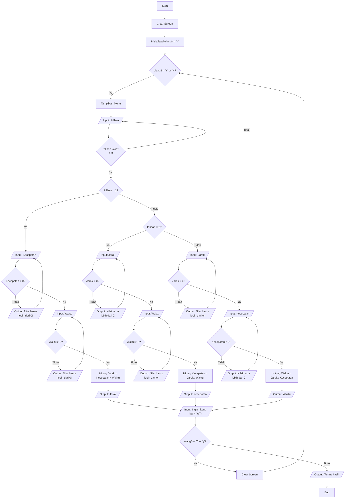

# Modul Kuliah: Program Menghitung Jarak, Waktu, dan Kecepatan
**Mata Kuliah**: Pemrograman Dasar
**Bahasa Pemrograman**: JUST BASIC v2.0
**Materi**: Implementasi Rumus Fisika dalam Program Komputer

## 1. Pendahuluan

### 1.1 Deskripsi Materi
Modul ini membahas implementasi rumus fisika dasar untuk menghitung jarak, waktu, dan kecepatan dalam bentuk program komputer. Program ini mendemonstrasikan penggunaan struktur kontrol, validasi input, dan perhitungan matematika sederhana.

### 1.2 Tujuan Pembelajaran
Setelah mempelajari modul ini, mahasiswa diharapkan dapat:
1. Memahami konsep dasar pemrograman BASIC
2. Mengimplementasikan rumus fisika ke dalam program
3. Memahami struktur kontrol program
4. Menerapkan validasi input
5. Membuat interface program yang user-friendly

### 1.3 Rumus yang Digunakan
- Jarak = Kecepatan × Waktu
- Kecepatan = Jarak ÷ Waktu
- Waktu = Jarak ÷ Kecepatan

## 2. Flowchart Program

### 2.1 Diagram Alir (Flowchart)


### 2.2 Penjelasan Flowchart

1. **Blok Start dan Inisialisasi**:
   - Program dimulai (Start)
   - Membersihkan layar (Clear Screen)
   - Menginisialisasi variabel ulang$ dengan 'Y'

2. **Blok Menu dan Validasi Pilihan**:
   - Menampilkan menu pilihan (1-3)
   - Memvalidasi input pilihan
   - Mengulang input jika tidak valid

3. **Blok Perhitungan**:
   a. Perhitungan Jarak (Pilihan 1):
      - Input dan validasi kecepatan
      - Input dan validasi waktu
      - Hitung jarak = kecepatan × waktu
      - Tampilkan hasil

   b. Perhitungan Kecepatan (Pilihan 2):
      - Input dan validasi jarak
      - Input dan validasi waktu
      - Hitung kecepatan = jarak ÷ waktu
      - Tampilkan hasil

   c. Perhitungan Waktu (Pilihan 3):
      - Input dan validasi jarak
      - Input dan validasi kecepatan
      - Hitung waktu = jarak ÷ kecepatan
      - Tampilkan hasil

4. **Blok Pengulangan dan End**:
   - Input pilihan menghitung lagi
   - Jika Ya: Kembali ke menu
   - Jika Tidak: Program berakhir

## 3. Script Program

### 3.1 Kode Program Lengkap
```basic
10 'Program untuk menghitung Jarak, Waktu, atau Kecepatan
20 cls 'Bersihkan layar

30 'Loop utama program
40 ulang$ = "Y"
50 while ulang$ = "Y" or ulang$ = "y"
    'Menampilkan Menu
60    print "================================="
70    print "Program Menghitung Jarak, Waktu, "
80    print "atau Kecepatan"
90    print "================================="
100   print "1. Hitung Jarak (dengan Kecepatan dan Waktu)"
110   print "2. Hitung Kecepatan (dengan Jarak dan Waktu)"
120   print "3. Hitung Waktu (dengan Jarak dan Kecepatan)"
130   print "================================="
140   do
150       print "Pilih opsi (1/2/3): ";
160       input pilihan$
170       pilihan = val(pilihan$)
180   loop until pilihan >= 1 and pilihan <= 3

    'Proses sesuai pilihan
190   if pilihan = 1 then
200       'Menghitung Jarak
210       do
220           print "Masukkan kecepatan (km/jam): ";
230           input kecepatan$
240           kecepatan = val(kecepatan$)
250           if kecepatan <= 0 then 
260               print "Nilai harus lebih besar dari 0!"
270           end if
280       loop until kecepatan > 0
    
290       do
300           print "Masukkan waktu (jam): ";
310           input waktu$
320           waktu = val(waktu$)
330           if waktu <= 0 then 
340               print "Nilai harus lebih besar dari 0!"
350           end if
360       loop until waktu > 0
    
370       jarak = kecepatan * waktu
380       print "Jarak yang ditempuh: "; jarak; " km"
390   end if

400   if pilihan = 2 then
410       'Menghitung Kecepatan
420       do
430           print "Masukkan jarak (km): ";
440           input jarak$
450           jarak = val(jarak$)
460           if jarak <= 0 then 
470               print "Nilai harus lebih besar dari 0!"
480           end if
490       loop until jarak > 0
    
500       do
510           print "Masukkan waktu (jam): ";
520           input waktu$
530           waktu = val(waktu$)
540           if waktu <= 0 then 
550               print "Nilai harus lebih besar dari 0!"
560           end if
570       loop until waktu > 0
    
580       kecepatan = jarak / waktu
590       print "Kecepatan: "; kecepatan; " km/jam"
600   end if

610   if pilihan = 3 then
620       'Menghitung Waktu
630       do
640           print "Masukkan jarak (km): ";
650           input jarak$
660           jarak = val(jarak$)
670           if jarak <= 0 then 
680               print "Nilai harus lebih besar dari 0!"
690           end if
700       loop until jarak > 0
    
710       do
720           print "Masukkan kecepatan (km/jam): ";
730           input kecepatan$
740           kecepatan = val(kecepatan$)
750           if kecepatan <= 0 then 
760               print "Nilai harus lebih besar dari 0!"
770           end if
780       loop until kecepatan > 0
    
790       waktu = jarak / kecepatan
800       print "Waktu yang diperlukan: "; waktu; " jam"
810   end if

820   print
830   print "Ingin menghitung lagi? (Y/T): ";
840   input ulang$
850   if ulang$ = "Y" or ulang$ = "y" then 
860       cls
870   end if
880 wend
890 print "Terima kasih telah menggunakan program ini!"
900 end
```

### 3.2 Penjelasan Script

1. **Bagian Inisialisasi (Baris 10-40)**:
   - Komentar program
   - Membersihkan layar
   - Inisialisasi variabel pengulangan

2. **Struktur Menu (Baris 50-180)**:
   - While loop untuk pengulangan program
   - Menampilkan menu dengan format
   - Validasi input pilihan

3. **Perhitungan Jarak (Baris 190-390)**:
   - Input dan validasi kecepatan
   - Input dan validasi waktu
   - Perhitungan dan output hasil

4. **Perhitungan Kecepatan (Baris 400-600)**:
   - Input dan validasi jarak
   - Input dan validasi waktu
   - Perhitungan dan output hasil

5. **Perhitungan Waktu (Baris 610-810)**:
   - Input dan validasi jarak
   - Input dan validasi kecepatan
   - Perhitungan dan output hasil

6. **Pengulangan Program (Baris 820-900)**:
   - Input pilihan menghitung ulang
   - Clear screen jika mengulang
   - Pesan terima kasih saat selesai

[Lanjutan modul seperti sebelumnya dengan Latihan, Kesimpulan, Referensi, dan Tugas]
